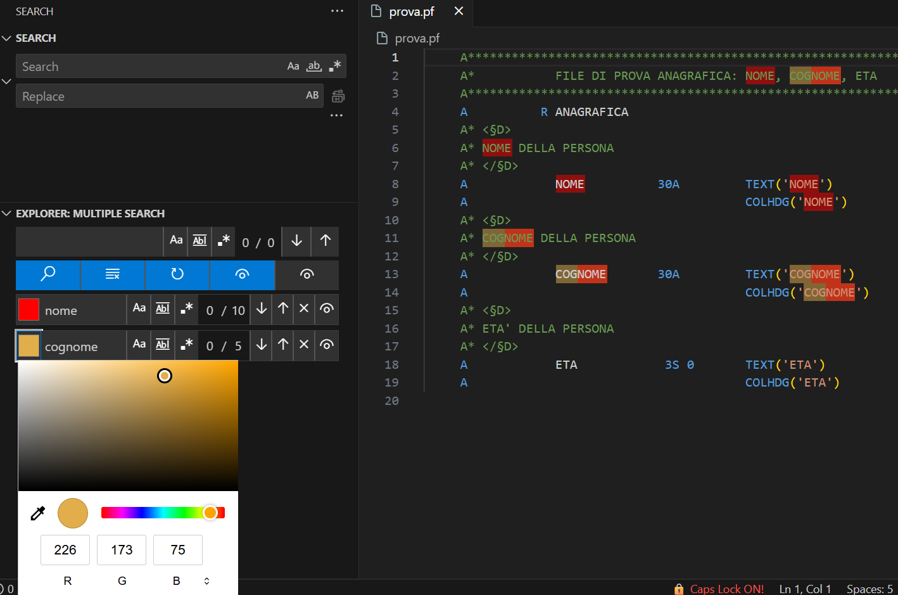

Scroll down to see the English version.
# Multiple Search (IT)

Multiple Search ti permette di cercare più stringhe contemporaneamente ed evidenziare ogni risultato con un colore configurabile.

Caratteristiche
- Cerca più termini nell'editor attivo e salvali nella cronologia
- Color picker per ogni voce per scegliere il colore dell'evidenziazione
- Marker di overview nella scrollbar per ogni voce (attivabili singolarmente o globalmente)
- Navigazione rapida (su/giu) per ogni ricerca

Come usarlo
1. Apri la view "Multiple Seach" nella sidebar Explorer.
2. Digita una ricerca nella casella in alto e premi Enter o il bottone di ricerca per aggiungerla alla cronologia.
3. Per ogni ricerca salvata puoi:
   - Modificare il testo della ricerca inline (si ri-esegue automaticamente dopo una breve pausa).
   - Scegliere il colore d'evidenziazione con il color picker a sinistra di ciascuna voce.
   - Attivare/disattivare i marker nella scrollbar per quella voce con l'icona a forma d'occhio.
   - Usare i bottoni su/giù per navigare tra le occorrenze.
   - Eliminare la voce con il tasto close.
4. Usa i pulsanti globali per attivare/disattivare i marker per tutte le voci contemporaneamente.
5. Usa il bottone Refresh per riapplicare tutte le ricerche all'editor attivo (utile quando cambi file).

Licenza
- Questo fork è distribuito sotto licenza MIT. Vedi `LICENSE.md`.

Progetto originale
- Questa estensione è basata su `mayonnaize.multiple-search` (MIT). Repo originale: https://gitlab.com/mayonnaize_group/vscode_extensions/vscode-multi-search

<!-- English README -->
# Multiple Search (EN)

Multiple Search lets you search for multiple strings at once and highlights each result in a configurable color.

Features
- Search multiple terms in the active editor and keep them saved as history entries
- Per-entry color picker to choose the highlight color
- Per-entry and global overview markers in the editor scrollbar
- Quick navigation (next/previous) for each search

How to use
1. Open the "Multiple Seach" view in the Explorer side bar.
2. Type a search in the top input and press Enter or the search button to add it to history.
3. For each saved search you can:
   - Change the search text inline (auto re-search after a short pause).
   - Pick the highlight color using the color picker at the left of each entry.
   - Toggle overview markers for that entry using the eye icon.
   - Use the up/down buttons to jump between matches for that entry.
   - Delete the entry with the close button.
4. Use the global buttons to enable/disable overview markers for all entries at once.
5. Use the Refresh button to reapply all searches to the active editor (useful when you switch files).

License
- This fork is distributed under the MIT license. See `LICENSE.md`.

Original project
- This extension is based on `mayonnaize.multiple-search` (MIT). Original repo: https://gitlab.com/mayonnaize_group/vscode_extensions/vscode-multi-search
